# Animal Shelter Database CRUD Module

## Project Overview

This project implements a Python module that provides CRUD (Create, Read, Update, Delete) functionality for an animal shelter database. The module is designed to serve as middleware between MongoDB and client applications, offering reusable code that manages animal records in a standardized and efficient manner.

## Purpose

The development of this CRUD module serves several important purposes:

1. To create a reusable library of code that acts as middleware between the database server and client applications
2. To provide standardized methods for interacting with the animal shelter database following industry best practices
3. To enable flexible data management that can potentially support multiple applications accessing the same database
4. To establish a foundation for future development
5. To enhance code maintainability and testing efficiency through modular, well-documented components

As the course materials emphasize, reusable code has numerous advantages in modern development environments. Organizations often need a database to serve multiple applications, and a well-designed middleware layer makes this possible while also allowing for potential future transitions to different database implementations.

I'd be happy to rewrite the answers from a first-person perspective. Here they are:

## How do I write programs that are maintainable, readable, and adaptable?

In developing my CRUD Python module for the Grazioso Salvare project, I implemented several key practices to ensure maintainability, readability, and adaptability:

I embraced **modular design** by organizing my code into distinct modules (crud.py, models.py, etc.), each with a specific purpose. This separation of concerns makes my code easier to understand and maintain.

I applied **object-oriented principles** through the `AnimalShelter` class that encapsulates all database operations. This provides a clean interface that hides implementation details, making my code more adaptable since internal changes won't affect code that uses this class.

I prioritized **comprehensive documentation** with detailed docstrings that explain the purpose of classes, methods, parameters, and return values. This significantly improves readability and will help future developers (or even my future self) understand how to use this code.

I implemented **robust error handling** with appropriate logging for all CRUD operations, making the code more maintainable because errors are easier to diagnose and fix.

I used **type hinting** to make my code more self-documenting and enable static type checking tools to catch potential issues before runtime.

I incorporated **data validation** through Pydantic models to ensure only valid data enters the system, improving reliability and maintainability.

The advantages of working this way were numerous:

1. **Reusability**: I could easily import and use my CRUD module in different applications, as I did in Project Two with the dashboard.

2. **Abstraction**: When building the dashboard, I didn't need to worry about MongoDB details; I could simply use my CRUD API.

3. **Testability**: I could test each component independently, as shown in my test_crud_notebook.ipynb.

4. **Scalability**: I can add new features without extensive modification to existing code.

In the future, I could use this CRUD module for:
- Building a REST API service that provides database access to multiple client applications
- Creating administrative tools for shelter staff to manage animal records
- Developing data analytics applications to track shelter outcomes and trends
- Supporting mobile applications for volunteers or potential adopters
- Integrating with other systems like veterinary records or adoption platforms

## How do I approach a problem as a computer scientist?

In approaching the Grazioso Salvare project, I followed a structured methodology that reflects my development as a computer scientist:

I began with **requirements analysis**, carefully examining what the client needed in terms of both functional requirements (CRUD operations, specific rescue type filters) and non-functional requirements (performance, usability).

I applied **abstraction** by identifying the core entities (animals) and operations needed, then creating a clean API that hides the complexities of database implementation.

I used **modular design** to break down the problem into sub-problems (database access, data modeling, visualization) that I could solve independently.

I followed an **iterative development** approach, progressing from basic CRUD functionality to a complete dashboard application, refining my solution at each stage.

I implemented **thorough testing and validation** to ensure my solution met all requirements, as demonstrated in my test notebook.

This approach differed from assignments in other courses that typically focus on implementing algorithms or solving well-defined problems. Here, I tackled:
- Open-ended requirements that needed interpretation and refinement
- Integration of multiple technologies (MongoDB, Dash, Plotly)
- Design decisions affecting usability and maintainability
- Production-quality concerns like error handling and documentation

For future database projects, I plan to use these strategies:
1. Start with thorough data modeling before implementation
2. Develop proof-of-concept prototypes to validate key assumptions
3. Apply established design patterns to solve common problems
4. Implement comprehensive testing at all levels
5. Document my design decisions for future reference

## What do computer scientists do, and why does it matter?

As a computer scientist, I solve complex problems through computational thinking, developing systems that transform data into valuable information. My Grazioso Salvare project demonstrates this approach.

My work helps Grazioso Salvare in several important ways:

1. **Efficient Data Management**: My CRUD module enables the company to store, retrieve, update, and delete animal records efficiently, replacing potentially manual or less structured systems.

2. **Data-Driven Decision Making**: The dashboard visualization I created allows staff to quickly identify dogs that meet specific criteria for different types of rescue training, helping them make better decisions about which animals to select.

3. **Process Automation**: By automating the filtering and visualization of data, I've eliminated time-consuming manual review processes, allowing staff to focus on higher-value activities like actual training.

4. **Information Accessibility**: The intuitive dashboard makes complex data accessible to non-technical users, democratizing access to information throughout the organization.

5. **Scalability**: As their program grows, my system can handle increasing volumes of data without significant changes to the underlying architecture.

I believe my work as a computer scientist matters because I bridge the gap between raw data and actionable information. My work doesn't just organize data—it transforms it into a strategic asset that supports Grazioso Salvare's mission of training rescue dogs. By making the right information available at the right time, I help the organization operate more efficiently, make better decisions, and ultimately save more lives through their rescue work.

This impact extends beyond this specific project. The computational thinking and problem-solving approaches I've developed can be applied to countless other domains where data-driven decisions make a difference.

## MongoDB Driver Selection

This project uses **PyMongo**, the official MongoDB driver for Python. PyMongo was chosen for several reasons:

1. **Comprehensive API**: PyMongo provides a complete set of tools for interacting with MongoDB
2. **Official Support**: As the official driver, it's regularly updated and maintained by MongoDB
3. **Performance**: It offers optimized performance for database operations
4. **Clear Documentation**: Extensive documentation makes implementation straightforward
5. **Industry Standard**: It's widely used in production environments, making the code more maintainable

## CRUD Operations

The AnimalShelter class provides four primary methods for interacting with the database:

### Create
- **Function**: `create(data)`
- **Purpose**: Inserts a new document into the specified MongoDB collection
- **Parameters**: Dictionary containing the animal data to insert
- **Returns**: Boolean indicating whether the insertion was successful
- **Usage Example**:
  ```python
  shelter.create({"animal_id": "A123456", "name": "Buddy", "animal_type": "Dog"})
  ```

### Read
- **Function**: `read(query)`
- **Purpose**: Retrieves documents from the collection based on query criteria
- **Parameters**: Dictionary containing the MongoDB query parameters
- **Returns**: List of documents matching the query criteria
- **Usage Example**:
  ```python
  results = shelter.read({"animal_type": "Dog", "breed": "Labrador"})
  ```

### Update
- **Function**: `update(query, update_data, multi=False)`
- **Purpose**: Modifies existing documents in the collection
- **Parameters**: 
  - `query`: Dictionary containing selection criteria
  - `update_data`: Dictionary containing update operations
  - `multi`: Boolean indicating whether to update multiple documents (default: False)
- **Returns**: Number of documents modified
- **Usage Example**:
  ```python
  count = shelter.update({"animal_id": "A123456"}, {"$set": {"name": "Max"}})
  ```

### Delete
- **Function**: `delete(query, multi=False)`
- **Purpose**: Removes documents from the collection
- **Parameters**: 
  - `query`: Dictionary containing selection criteria
  - `multi`: Boolean indicating whether to delete multiple documents (default: False)
- **Returns**: Number of documents deleted
- **Usage Example**:
  ```python
  count = shelter.delete({"animal_id": "A123456"})
  ```

## How to Use the Module

### Installation

1. Ensure you have MongoDB installed and running on your system
2. Import the Austin Animal Center Outcomes dataset into MongoDB
3. Create a user account with appropriate permissions for database access
4. Install the required Python libraries:
   ```bash
   pip install pymongo pydantic
   ```

### Basic Usage

```python
from grazioso.crud import AnimalShelter

# Create a new instance with MongoDB connection details
shelter = AnimalShelter(
    username="aacuser",
    password="password",
    host="localhost",
    port=27017,
    db_name="AAC",
    collection_name="animals"
)

# Create a new animal record
new_animal = {
    "animal_id": "A123456",
    "name": "Buddy",
    "animal_type": "Dog",
    "breed": "Labrador Retriever",
    "color": "Black"
}
success = shelter.create(new_animal)

# Read animal records
dogs = shelter.read({"animal_type": "Dog"})

# Update a record
modified_count = shelter.update(
    {"animal_id": "A123456"},
    {"$set": {"name": "Max"}}
)

# Delete a record
deleted_count = shelter.delete({"animal_id": "A123456"})

# Close the connection when done
shelter.close()
```

## Module Implementation Details

The CRUD module is implemented using object-oriented programming principles. Key features of the implementation include:

1. **Connection Management**: The module handles MongoDB connection establishment and authentication
2. **Exception Handling**: Robust error handling ensures the application can respond gracefully to failures
3. **Logging**: Comprehensive logging provides visibility into operations for debugging and monitoring
4. **Type Checking**: Strong type hints help catch errors before runtime
5. **Data Validation**: Optional integration with Pydantic models for data validation

## Data Import and Authentication Screenshots

Below are screenshots of the data import process and authentication setup. These demonstrate that the MongoDB database has been properly configured with the Austin Animal Center dataset and user authentication.

Importing the dataset using `mongoimport`

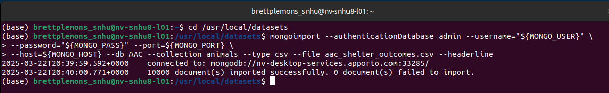

Creating a new user

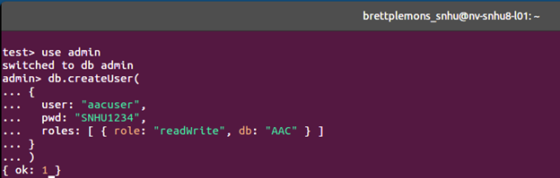

Setting Environment Variables and Connecting as New User

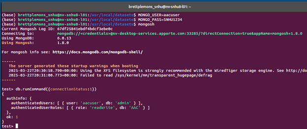

Testing New User DB Access

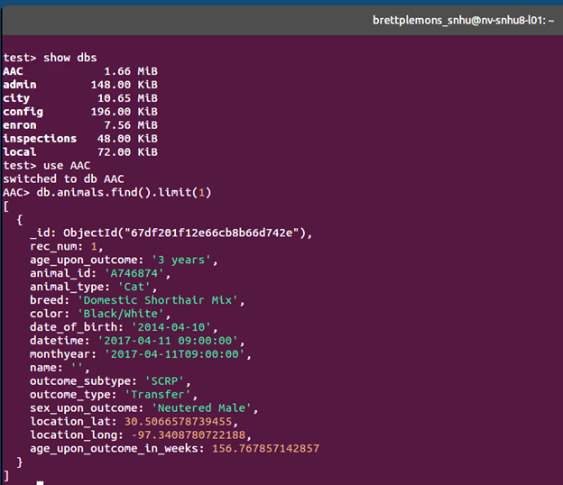

## CRUD Functionality Demonstration

The following screenshots show the successful execution of CRUD operations using the module:

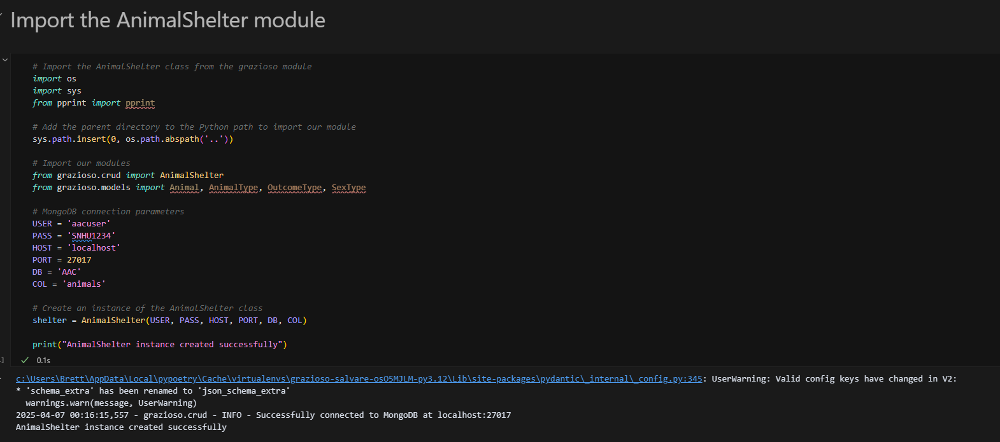

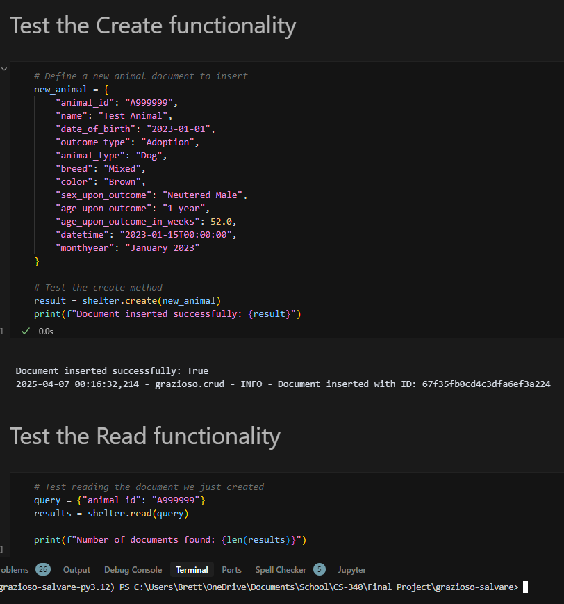

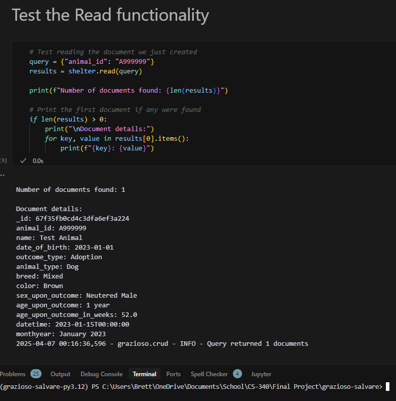

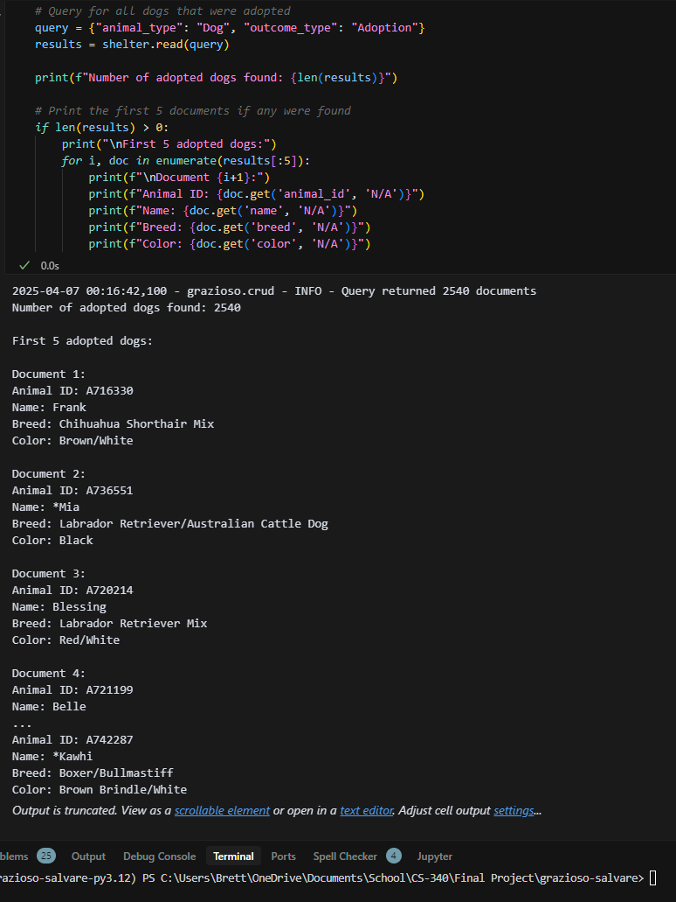

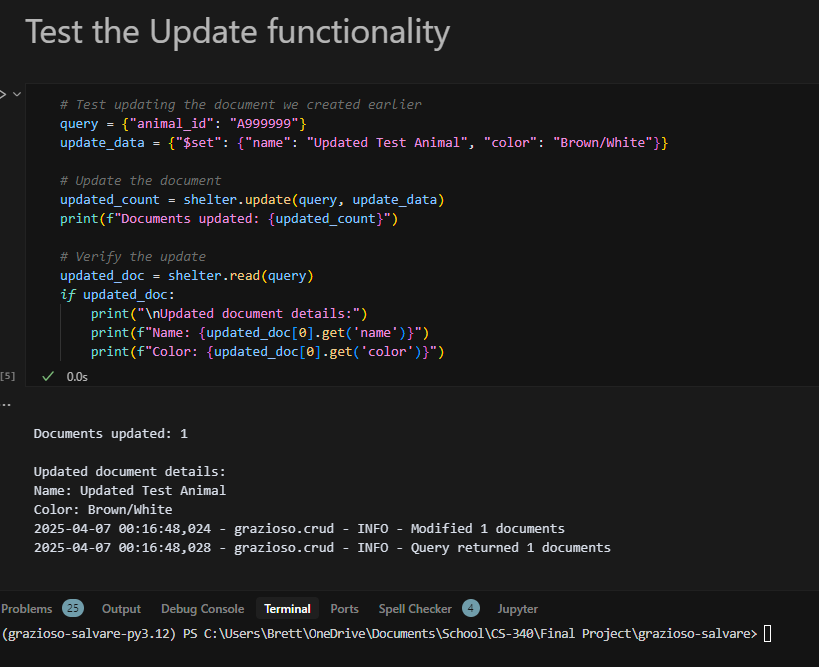

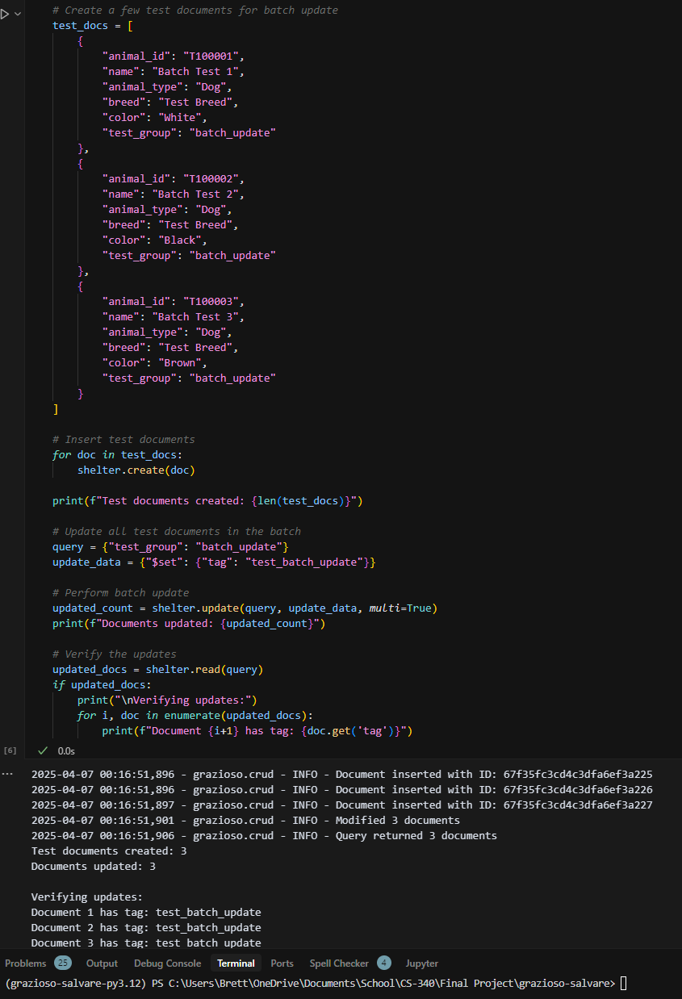

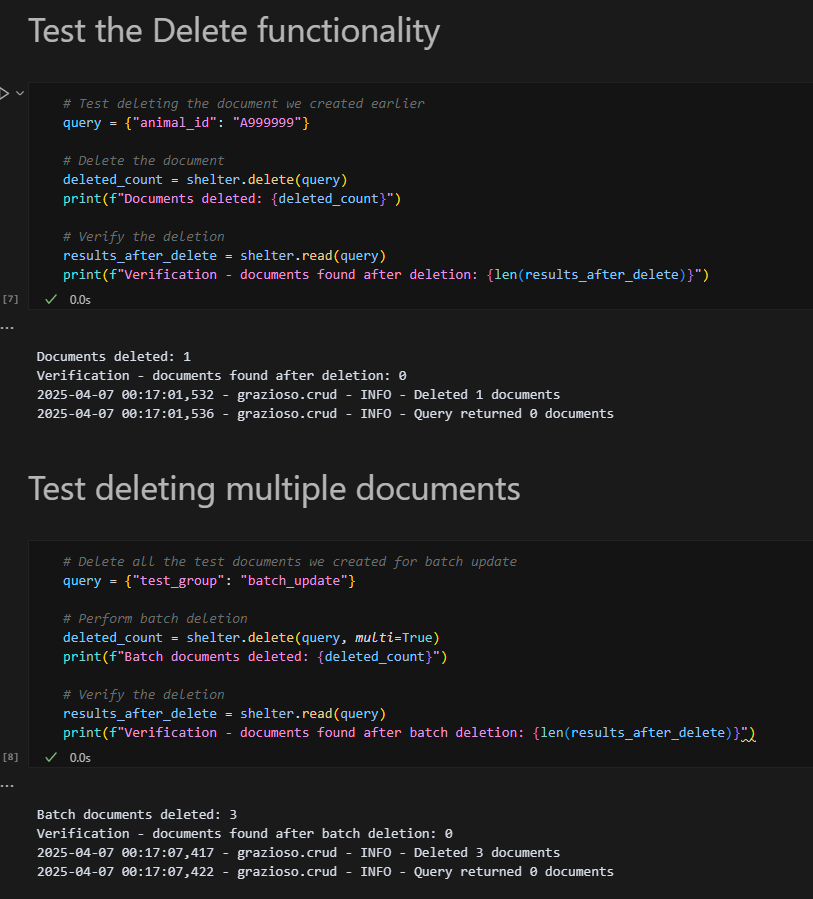

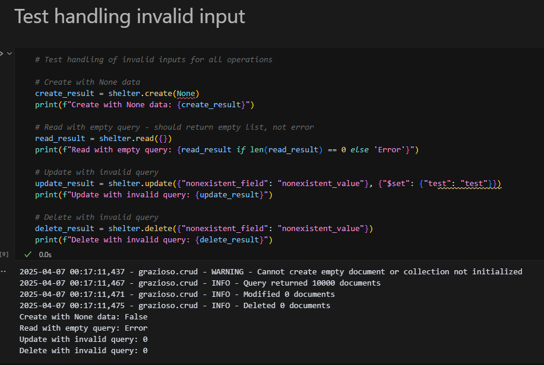

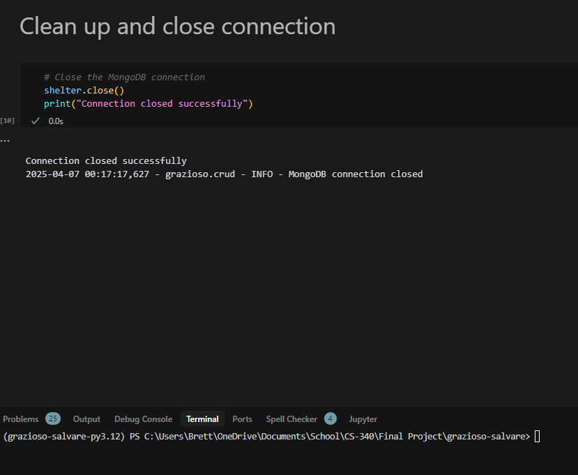

## Dash User Interface

The following screenshots show the successful execution of the Dash user interface within the Jupyter Notebook:


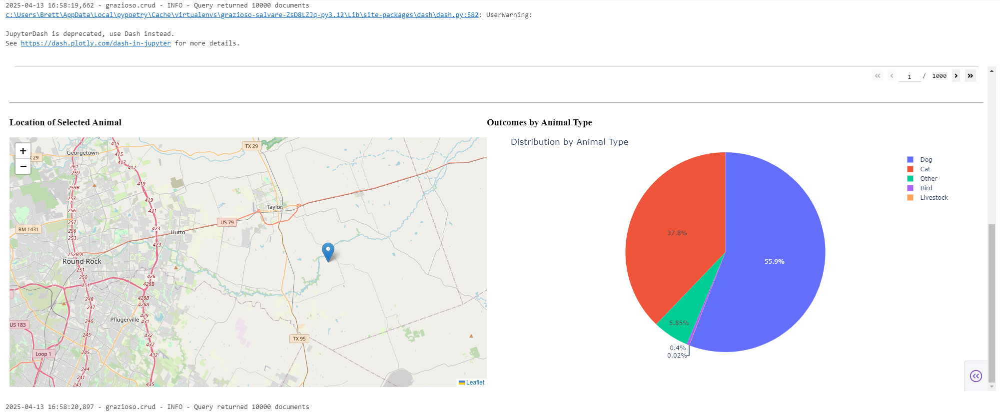

## Development and Testing

The project includes a Jupyter Notebook for testing all CRUD functionality. This notebook demonstrates:

1. Creating new animal records
2. Querying for specific animals and collections of animals
3. Updating animal records (both single and batch updates)
4. Deleting animal records (both single and batch deletions)
5. Error handling for invalid inputs

To run the tests, open the `tests/test_crud.ipynb` notebook and execute each cell sequentially.

## Contact

Your Name: Brett Plemons
